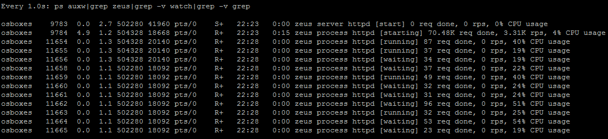
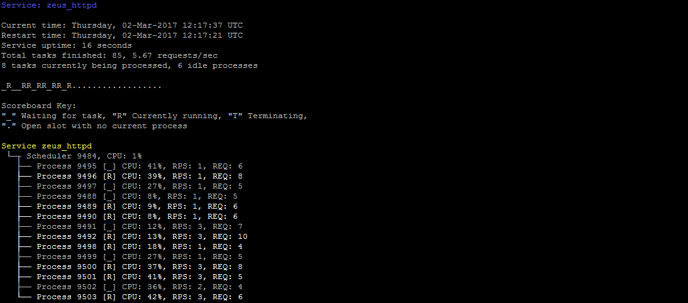

[](https://travis-ci.org/artur-graniszewski/ZEUS-for-PHP) [](https://coveralls.io/github/artur-graniszewski/ZEUS-for-PHP?branch=master)

# Introduction


**ZEUS for PHP** is an event-driven, preemptive _Multitasking Runtime Environment_ and _Service Management System_ integrated with Zend Framework 3. It's main purpose is to perform multiple tasks (processes) concurrently.

To guarantee true parallelism and resource isolation ZEUS employs preemptive schedulers and an Inter-Process Communication mechanism to allow its processes to share the data.

ZEUS Runtime Environment consists of two layers (user mode and kernel mode) with following components within both of these layers:

## Kernel Mode

### Process

In ZEUS, Process is defined as an instance of a PHP application that is being executed. 

The execution of a single process must progress in a sequential fashion, therefore to achieve true concurrency, ZEUS may use _Process Scheduler_ to instantiate more than one such process at the same time.

When a process executes, it passes through different states. In ZEUS, a process can have one of the following five states at a time:


Process can use hardware resources in only two states: waiting and running.

The following table describes each state in details:

| State      | Description                                                                                                                                 |
|------------|---------------------------------------------------------------------------------------------------------------------------------------------|
| STARTED    | An initial state when a process is first created                                                                                            |
| WAITING    | Process is in a waiting state if it needs to wait for a resource, such as waiting for network connection, or some data to become available  |
| RUNNING    | Process sets the state to running just before it starts processing its data                                                                 |
| TERMINATED | When process is terminated by the Process Scheduler, it is moved to the terminated state where it waits to be removed from the Task Pool    |
| EXITED     | This state is set when process finishes its execution, and it waits to be removed from the Task Pool                                        |


### Process Scheduler

The _Process Scheduler_ is responsible for removal of running processes* from the CPU and the selection of another processes using the Task-Pool strategy. 

It implements the concept of a _Server Service_, which is treated as a group of processes that can be managed as a whole, share same data and be placed under shared restrictions (such as timeouts, resource usage or effective user privileges). As Process Scheduler has the ability to stop and start processes - it decides how many processes are to run as part of a each Service, and the degree of concurrency to be supported at any one time.

Scheduler is responsible for:

- running _Server Services_ in parallel using __preemptive multitasking__
- supporting custom _Multi-Processing Modules_
- managing the number of processes based on a Task-Pool strategy
- handling Process lifecycle
- keeping track of and reporting Process state

Multiple _Process Schedulers_ can be configured in a regular Zend Framework 3 configuration file, like so:

```php
return [
    'zeus_process_manager' => [
        'schedulers' => [
            'scheduler_1' => [
                'scheduler_name' => 'sample_scheduler',
                'multiprocessing_module' => PosixProcess::class,
                'max_processes' => 32,
                'max_process_tasks' => 100,
                'min_spare_processes' => 3,
                'max_spare_processes' => 5,
                'start_processes' => 8,
                'enable_process_cache' => true
            ]
        ]
    ]
];
```

The table below describes the configuration parameters:

| Parameter              | Required | Description                                                                           |
|------------------------|:--------:|---------------------------------------------------------------------------------------|
| scheduler_name         | yes      | Unique name of the scheduler configuration                                            |
| multiprocessing_module | yes      | Specifies a `MultiProcessingModuleInterface` implementation to be used in a Scheduler |
| start_processes        | yes      | Specifies the number of processes that will initially launch with each Server Service |
| max_processes          | yes      | Maximum number of running/waiting processes of each Server Service                    |
| max_process_tasks      | yes      | Maximum number of tasks performed by each process before its exit                     |
| enable_process_cache   | yes      | Controls whether pre-forking mechanism should be used for increased performance       |
| min_spare_processes    | yes      | Minimal number of processes in a waiting state when process cache is enabled          |
| max_spare_processes    | yes      | Maximum number of waiting processes when the process cache is enabled                 |


### Multi-Processing Modules

Certain multitasking architectures are incompatible or not efficient enough on different operating systems. To remedy this issue, ZEUS provides a Multi-Processing Module interface between an application and the underlying operating system that is designed to hide these differences by providing a consistent platform on which the application is run. 
 
MPM's primary role is to optimize ZEUS for each platform, by providing platform specific architecture implementation that might be more advantageous than others.

_ZEUS is shipped with a POSIX compliant process implementation which is well suited for most \*nix operating systems._

Custom made MPMs must implement `Zeus\Kernel\ProcessManager\MultiProcessingModule\MultiProcessingModuleInterface`

### Inter-Process Communication Server

ZEUS provides the mechanisms for multiple processes to communicate with one another and share the data.

By default, ZEUS uses Named Pipes (FIFO) mechanism to communicate with its processes. 

The pluggable _IPC Server_ is shipped with four different IPC implementations (FIFO, APCu Shared Memory, SystemV, Socket) that can be enabled in ZEUS configuration depending on the operating system in use, or a developer preference.

_If selected IPC implementation is not yet supported or is ineffective on a given platform, plugging a different IPC adapter or writing a new one may be necessary._

## User Mode

### Server Service Manager

In ZEUS _Server Service Manager_ is a component responsible for managing and instantiating ZEUS Server Services*. 

It allows to:

- view a list of installed Server Services along with their names, description and configuration
- start and stop a single Server Service
- auto-start multiple Server Services based depending on their configuration

_\* In ZEUS, Server Service is a set of one or more PHP processes running concurrently in the background. It's code must conform to the interface rules of the Server Service Manager._

Multiple _Server Services_ can be configured in a regular Zend Framework 3 configuration file, like so:

```php
return [
    'zeus_process_manager' => [
        'services' => [
            'service_name_1' => [
                'auto_start' => false,
                'service_name' => 'some_service_name',
                'scheduler_name' => 'sample_scheduler',
                'service_adapter' => 'CustomZendFrameworkServiceName',
                'logger_adapter' => LoggerInterface::class
                'service_settings' => [
                    'service_custom_data' => 'value'
                ]
            ]
        ]
    ]
];
```

The table below describes the configuration parameters:

| Parameter        | Required | Description                                                                                 |
|------------------|:--------:|---------------------------------------------------------------------------------------------|
| service_name     | yes      | Unique name of this _Server Service_                                                        |
| scheduler_name   | yes      | Specifies which Scheduler configuration should be used to run this service                  |
| service_adapter  | yes      | Specifies which `Zeus\ServerService\ServiceInterface` implementation should be launched     |
| logger_adapter   | no       | Allows to use a custom `Zend\Log\LoggerInterface` implementation for service logging        |
| auto_start       | yes      | Instructs _Server Service Manager_ to run this service automatically on ZEUS startup        |
| service_settings | no       | Allows to pass a set of custom parameters to the _Server Service_ factory                   |

If no `logger_adapter` is specified, ZEUS injects its own _Logger_ instance to the service.

To launch all `auto_start` enabled _Server Services_, the following command must be used in a user terminal:

```php public/index.php zeus start```

### Logger

ZEUS provides a set of components able to record either events that occur in its core services, or messages between different processes.

By default ZEUS log entries are written to `STDOUT` (standard output stream) and therefore, visible as a user-friendly text in the user terminal.


Different output streams, as well as custom `Logger` adapters can be provided through a Zend Framework `ServiceManager` and its configuration files, like so:

```php
return [
    'zeus_process_manager' => [
        'logger' => [
            'reporting_level' => \Zend\Log\Logger::DEBUG,
            'output' => 'php://stdout',
            'show_banner' => true,
            'logger_adapter' => 'CustomLoggerServiceName'
        ]
    ]
];
```

The table below describes the configuration parameters:

| Parameter        | Required | Description                                                                                 |
|------------------|:--------:|---------------------------------------------------------------------------------------------|
| reporting_level  | no       | Minimum severity required to log the event (see `Zend\Log\Logger::*`, default: `DEBUG`)     |
| output           | no       | Specifies where to write the logs, used only by default ZEUS logger, default: `STDOUT`      |
| show_banner      | no       | Controls whether default ZEUS logger should render its banner on startup or not             |
| logger_adapter   | no       | Allows to use a custom `Zend\Log\LoggerInterface` implementation for service logging        |

### Web Server Service

ZEUS Web Server is a simple _Server Service_ HTTP/1.1 daemon responsible for hosting _Zend Framework 3_ web applications in a multi-processing environment.

_When serving Zend Framework 3 PHP applications - it's able to outperform other, standalone servers such as Apache HTTPD or NGINX by a margin of up to 30%._

In case of acting as as server for static content such as images or binary files, ZEUS Web Server can be up to 50% slower than the Apache counterpart (but still able to handle more than **16000** static file requests per second on a 3.2Ghz _Intel Core i7_ processor).


**Please note:** 
>ZEUS Web Service is not a full-featured web server. In it's current state, it's meant to be used as a development aid or a simple, yet efficient intranet web service without a direct access to a public network.
>
> If required, for increased security and performance, this server can be launched behind a forward proxy such as Varnish, NGINX Proxy or Squid.

This service is not enabled by default, but can be configured to auto-start with ZEUS if needed.

To start the service manually, following command must be executed:

```php public/index.php zeus start zeus_httpd```

# ZEUS requirements

## OS requirements
- Linux/Unix/BSD platform
- _Windows platform currently not supported_

## PHP requirements
- PHP 5.4+, PHP 7+ recommended for performance reasons (up to 4x faster)
- Posix module installed and enabled
- Pcntl module installed and enabled
- socket functions enabled for IPC purposes

## Library requirements
- Zend Framework 3+ (with the following modules installed: MVC, Console MVC, Console, Logger)
- ReactPHP library

# First steps
## Installation

ZEUS for PHP can be installed in two different ways:

- via Composer: ```composer require zeus-server/zf3-server```
- by unpacking ZEUS source code into your ZF3 `module` directory

## Initial Configuration

After installation, ZEUS for PHP must be activated in Zend Framework's `config/module.config.php` file, like so:

```php
return [
    'Zend\\Log',
    'Zend\\Mvc\\Console',
    '...',
    'Zeus'
];
```

If ZEUS for PHP is installed correctly, the following terminal command will list its  _Server Services_:

```php public/index.php zeus list```

## Starting ZEUS Web Server

To start the service manually, following command must be executed:

```php public/index.php zeus start zeus_httpd```

In its default configuration, Zend Framework 3 web application can be found under http://localhost:7070/ URL (hostname may be different, if service was started remotely).

## Tracking Sever Service status

ZEUS for PHP is able to report current status of its Server Services to the user. It achieves this by modifying names of the active processes, which in turn, can be watched real-time in tools like `top`, `htop` or `ps`:



Also, since version 1.2.0, a new set of command line options is available:

```php public/index.php zeus status``` and ```php public/index.php zeus start <service name>```

Which will show the user-friendly Server Service status:


## Creating a custom Server Service

Every _Server Service_ needs to implement ```Zeus\ServerService\ServiceInterface```. 

To speed up the development process, ZEUS is shipped with the following classes and factories that can be used as a base for new services:

- `Zeus\ServerService\Shared\AbstractServerService` - a very crude boilerplate for new _Server Services_
- `Zeus\ServerService\Shared\Factory\AbstractServerServiceFactory` - an abstract Zend Framework factory that creates _Server Services_ if they don't use their own factories. 

Each service must be listed in the `services` section of `zeus_process_manager` configuration entry and point to a valid _Scheduler_ configuration (or specify its own implementation in ZEUS `schedulers` section), like so:
 
```php
return [
    'zeus_process_manager' => [
        'services' => [
            'service_name_1' => [
                'auto_start' => false,
                'service_name' => 'some_service_name',
                'scheduler_name' => 'sample_scheduler',
                'service_adapter' => 'CustomZendFrameworkServiceName',
                'logger_adapter' => LoggerInterface::class
                'service_settings' => [
                    'service_custom_data' => 'value'
                ]
            ]
        ],
        'schedulers' => [
            'scheduler_1' => [
                'scheduler_name' => 'sample_scheduler',
                'multiprocessing_module' => PosixProcess::class,
                'max_processes' => 32,
                'max_process_tasks' => 100,
                'min_spare_processes' => 3,
                'max_spare_processes' => 5,
                'start_processes' => 8,
                'enable_process_cache' => true
            ]
        ]
    ]
];
```

The above configuration parameters have been described in the __Process Scheduler__ and __Server Service Manager__ documentation chapters.

# Road map

## Short-term

### Documentation
- Improvement of ZEUS documentation
- Tutorials and How-to's

### Web Server
- Code refactor and HTTP performance improvements
- Performance improvements in Application dispatcher when handling Zend Framework applications
- Removing dependency on ReactPHP
- More configuration options

### Inter-Process Communication
- Various code improvements in IPC adapters
- Introduction of IPC strategy that will choose the most efficient IPC implementation depending on a platform.

### Server Service Manager
- Additional `EventManager` events covering full application lifecycle
- More advanced Service reporting and control tools for terminal and remote use
- Add a plugin that drops user privileges on start of the _Server Service_

### Process Manager
- Configurable, more robust scheduling strategies (like terminating processes that handled the largest amount of request, etc)*[]: 

### Tests
- More automatic tests

# Long-Term

### POSIX Threads
- Adding support for threads in PHP

### Connection pooling
- NGINX like connection pooling in ZEUS Web Server (performance improvement)
- Abstract Server Service classes that will speed up the development of other types of connection pooling services
- Database connection pooling (?)

### FastCGI/FPM
- Add possibility to execute Server Services in isolated PHP instances
- Allow ZEUS Web Server to host FastCGI/FPM applications

### Experimental support for Windows platform

### Other services
- Redis Server Service implementation PoC
- More features introduced to ZEUS Web Server

# Changelog

## Version 1.2.3
- [Feature] Introduced `ON_PROCESS_CREATED` event to `Scheduler`
- [Feature] Now its possible to intercept `ON_SCHEDULER_STOP` event before `exit()`
- [Fix] Fixed various `ON_SCHEDULER_STOP` event triggering inconsistencies
- [Fix] Added `ext-pcntl` to Composer as required PHP extension
- [Tests improvements] Improved code coverage + dead code removed

## Version 1.2.2
- [Feature] Added `StreamLogFormatter` and basic strategy that chooses between `StreamLogFormatter` and `ConsoleLogFormatter` depending on stream type.
- [Fix] Added `zendframework/zend-console` as required Composer package
- [Tests improvements] Improved code coverage

## Version 1.2.1
- [Fix] Renamed status names reported by a Service Status command to be inline with those reported by Proces Title functionality

## Version 1.2.0
- [Feature] Added new commandline options `index.php zeus status` and `index.php zeus status <service_name>`
- [Fix] Fixed Scheduler's `ON_SERVER_START` and `ON_SCHEDULER_START` event triggering inconsistency
- [Fix] Refactor of `FixedCollection` iterator code for improved HHVM compatibility
- [Fix] Fixed request counter in ZEUS Web Server
- [Tests improvements] Improved code coverage

## Version 1.1.8
- [Feature] Added MIME type detection to ZEUS Web Server's `StaticFileDispatcher`
- [Tests improvements] Code coverage for `StaticFileDispatcher`
- [Fix] ZEUS Web Server returned 404 HTTP status code instead of 400 when attempting to list a directory
- [Fix] Fixed compatibility between `FixedCollection` and HHVM
- [Fix] Resolved issue wih invalid handling of first element in `FixedCollection`

## Version 1.1.7
- [Fix] Fixed read/write indexing in `ApcAdapter`
- [Fix] Performance fix in HTTP hosts cache (ZEUS Web Server)
- [Tests improvements] Code coverage tests moved from PHP 5.6 to 7.1
- [Tests improvements] Enabled APCu tests in Travis

## Version 1.1.6
- [Fix] Various fixes for IpcAdapters: `MsgAdapter`, `ApcAdapter`, `FifoAdapter`
- [Fix] Fixed permissions of some PHP files

## Version 1.1.5
- [Feature] New event `Zeus\Kernel\ProcessManager\EventsInterface::ON_PROCESS_EXIT` introduced
- [Feature] Improved console help
- [Unclassified] Dead code removal, README tweaks
- [Tests improvements] More `Scheduler` tests added

## Version 1.1.4
- [Unit tests fix] Fix for division by zero error in PHP 5.6 unit tests in `ProcessTitle` class
- [Tests improvements] Added test class for Scheduler, increased tests code coverage
- [Fix] Fixed PHP 5.6 compatibility in `Scheduler` garbage collection mechanism 

## Version 1.1.3
- [Feature] Enabled travis build and improved phpunit configuration
- [Unit tests fix] Fix for failing phpunit tests due to the recent changes in ZEUS Web Server classes and interfaces
- [Security fix] Fixed ZEUS Web Server logger throwing fatal exception and leaving open connection when HTTP request was corrupted
- [Unclassified] Various `composer.json` fixes and tweaks

## Version 1.1.2
- [Composer fix] Corrected PSR4 installation path in `composer.json` file
- [Documentation] Updated road-map

## Version 1.1.1
- [Composer fix] Specified ZEUS license type in `composer.json`
- [Documentation fix] Fixed command syntax that installs ZEUS via Composer

## Version 1.1.0
- [Performance fix] ZEUS Web Server uses a custom React PHP `Buffer` implementation to overcome severe `fwrite` performance penalty when serving large files through a keep-alive connection
- [Security fix] ZEUS Web Server counts the number of keep-alive requests and closes connection when the requests limit is reached.
- [Feature] Implemented `IpcLoggerInterface` and `IpcLoggerWriter` to send logs through IPC to a Scheduler which will act as as a logger sink.
- [Feature] Service name is now reported by a built-in logger processor 

## Version 1.0.0
- Initial revision